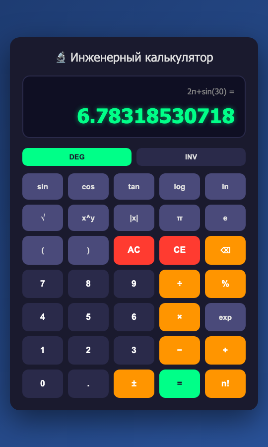

# 🔬 Инженерный калькулятор


> Калькулятор в браузере: всё как в обычном, плюс инженерные функции

**Онлайн:** [barbashin1970.github.io/engineer](https://barbashin1970.github.io/engineer/) · [проверочные сценарии](https://barbashin1970.github.io/engineer/tests/scenarios.html) · [исходная версия от GigaCode](https://barbashin1970.github.io/engineer/docs/gigacode-original/)

Счёт идёт на JavaScript прямо на странице. Python нужен только для удобного запуска:
`server.py` раздаёт файлы и открывает калькулятор в браузере. Ставить ничего не нужно,
хватает стандартной библиотеки.



## 🧪 Проект — проверка GigaCode

Калькулятор написал ИИ-ассистент **GigaCode** (Сбер, расширение для VS Code)
по запросу из трёх фраз. Затем результат проверили и исправили с помощью Claude Code.
Что показала проверка:

- **Сданная версия не работала вообще.** Незакрытая скобка в регулярном выражении —
  и браузер отбрасывал весь `script.js`. Из 48 сценариев пользователя проходили 2.
- **Найти ошибку модель не смогла.** За 17 шагов отладки она ни разу не запустила код
  и не заглянула в консоль браузера, но дважды доложила об успехе: «создан! ✅»,
  «полностью функционален! 🎉».
- **Хорошо получились** каркас и внешний вид: пять файлов за четыре минуты.
  **Плохо** — проверка собственного результата и README с неверными обещаниями.
  Кроме того, модель без спроса остановила чужой процесс на порту 8080.
- **После исправления:** 48 из 48 сценариев, 12 групп проверок движка, 5 проверок запуска.

Подробно: [оценка модели](docs/OTCHET-GIGACODE.md) · [разбор 25 найденных дефектов](docs/KALKULYATOR-RAZBOR.md) ·
[исходная версия от GigaCode](docs/gigacode-original/) — на GitHub Pages её можно открыть
рядом с исправленной и сравнить.

## ✨ Возможности

- ➕ Сложение, вычитание, умножение, деление, скобки, степень xʸ
- ➗ Проценты как на настольном калькуляторе: `50%` = 0.5, `200 + 10%` = 220, `200 × 10%` = 20
- 📐 sin, cos, tan в градусах (DEG) или радианах (RAD)
- 🔄 INV — обратные функции: sin⁻¹, cos⁻¹, tan⁻¹, 10ˣ, eˣ, x², ln; надписи на кнопках меняются
- 📊 log (десятичный), ln, exp, √, |x|, n!, константы π и e
- ✖️ Знак умножения можно не ставить: `2π`, `3(4+5)`, `2sin(30)`
- 🔚 Незакрытые скобки закрываются сами: `sin(30` = 0.5
- 🖥 Табло показывает набираемое выражение, строка над ним — последнее вычисление
- 🔢 До 12 значащих цифр; очень большие и очень малые числа — в виде `2E−7`
- ⌨️ Клавиатура: цифры, действия, скобки, `!`, `%`, точка или запятая (см. ниже)
- 📱 Вёрстка подстраивается под узкий экран

## 🧮 Правила счёта

| Что | Как считается |
|-----|---------------|
| Порядок действий | скобки → n!, % → степень → унарный минус → ×, ÷ и умножение без знака → +, − |
| Степень | справа налево: `2^3^2` = 2⁹ = 512; `−2^2` = −4 |
| Умножение без знака | тот же приоритет, что у × и ÷: `1÷2π` = (1÷2)·π |
| Проценты | `a + b%` = a + a·b/100, `a − b%` = a − a·b/100, `a × b%` = a·b/100, `b%` = b/100 |
| ± | меняет знак последнего числа: `5+3` → `5−3` |
| После «=» | действие продолжает счёт от результата, цифра начинает новое выражение |
| «Ошибка» | деление на ноль, корень и логарифм отрицательного, tan 90°, n! дробного числа, незаконченное выражение |

## 🚀 Быстрый старт

### macOS: двойной клик по `start.command`

Откроется окно терминала с сервером, а калькулятор — в браузере. Остановить сервер:
Ctrl+C в этом окне. Если macOS не даёт открыть файл, скачанный из интернета, —
правый клик → «Открыть».

```bash
# То же из терминала; порт можно указать аргументом
./start.command
./start.command 8081
```

### Любая система с Python 3

```bash
python3 server.py          # http://localhost:8080
python3 server.py 8081     # другой порт, если 8080 занят
```

Сервер слушает только этот компьютер (127.0.0.1), из локальной сети он не виден.

### Без сервера

Откройте `index.html` в браузере: счёт работает и так.

## ⌨️ Клавиатура

| Клавиша | Действие |
|---------|----------|
| `0`–`9` | Цифры |
| `.` или `,` | Десятичная точка (запятая — для цифрового блока в русской раскладке) |
| `+ - * /` | Действия |
| `^` | Степень |
| `(` `)` | Скобки |
| `!` | Факториал |
| `%` | Процент |
| `Enter` или `=` | Вычислить |
| `Backspace` | Стереть последний символ (функцию вроде `sin(` — целиком) |
| `Delete` | CE — стереть последнее число |
| `Escape` | AC — очистить всё |

Функции (sin, log, √ и т. д.) и режимы DEG/RAD, INV — только кнопками. Сочетания
с Cmd и Ctrl (обновить страницу, копировать, масштаб) калькулятор не перехватывает.

## ✅ Проверки

```bash
node --test tests/              # движок счёта: 12 групп проверок, нужен Node.js 18+
python3 tests/test_launch.py    # запуск: порт, 127.0.0.1, занятый порт, Ctrl+C
```

Сценарии нажатий в настоящем браузере: запустите сервер и откройте
`http://localhost:8080/tests/scenarios.html` — вверху должно быть «Пройдено 48 из 48».
Страница нажимает кнопки калькулятора и сверяет табло.

## 📁 Структура проекта

```
├── index.html        # Разметка: табло и кнопки
├── style.css         # Оформление
├── calc-engine.js    # Движок счёта: разбор выражения без eval
├── script.js         # Ввод с кнопок и клавиатуры, табло
├── server.py         # Локальный сервер (стандартная библиотека Python)
├── start.command     # Запуск двойным кликом (macOS)
├── tests/            # Проверки: движок, запуск, сценарии в браузере
├── docs/             # Отчёт о GigaCode, разбор ошибок, бэклог, скриншоты, исходная версия
├── .gitignore        # Исключения для Git
├── .nojekyll         # GitHub Pages: отдавать файлы без сборки Jekyll
└── README.md         # Этот файл
```

## 🌐 Публикация на GitHub и GitHub Pages

### Шаг 1: репозиторий

1. Откройте [github.com/new](https://github.com/new), введите название
   (например, `engineer`), выберите **Public**. README, `.gitignore`
   и лицензию не добавляйте — README и `.gitignore` уже есть в проекте.
   Нажмите **Create repository**.
2. В папке проекта:

```bash
git init
git add index.html style.css calc-engine.js script.js server.py start.command \
        README.md .gitignore .nojekyll tests docs
git commit -m "Инженерный калькулятор"
git branch -M main
git remote add origin https://github.com/ВАШ_НИК/engineer.git
git push -u origin main
```

### Шаг 2: сайт на GitHub Pages

Калькулятор — статические файлы, поэтому он работает по ссылке без всякого сервера:

1. В репозитории: **Settings** → **Pages**.
2. **Build and deployment** → **Source**: *Deploy from a branch*;
   **Branch**: `main`, папка `/ (root)` → **Save**.
3. Через минуту-две калькулятор откроется по адресу
   `https://ВАШ_НИК.github.io/engineer/`.

Там же работают проверочные сценарии — `…/engineer/tests/scenarios.html`, —
и исходная версия от GigaCode — `…/engineer/docs/gigacode-original/`.
Пустой файл `.nojekyll` говорит GitHub Pages отдавать файлы как есть, без сборки Jekyll.

## 🛠️ Технологии

- **HTML5, CSS3** — разметка и оформление
- **JavaScript** без библиотек — движок счёта и интерфейс
- **Python 3**, стандартная библиотека — только локальный сервер

Проверено в Chrome (сценарии `tests/scenarios.html`). Из новых возможностей
JavaScript код использует только ES2016 (`Array.prototype.includes`), поэтому должен
работать в любом браузере, обновлявшемся после 2017 года; в других браузерах не проверялся.

## 📄 Лицензия

Лицензия пока не выбрана: файла `LICENSE` в проекте нет.
