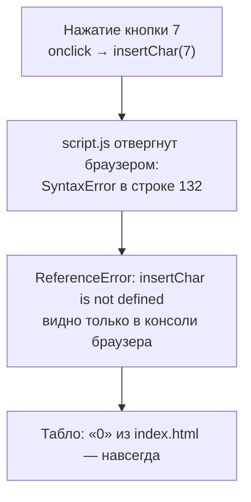
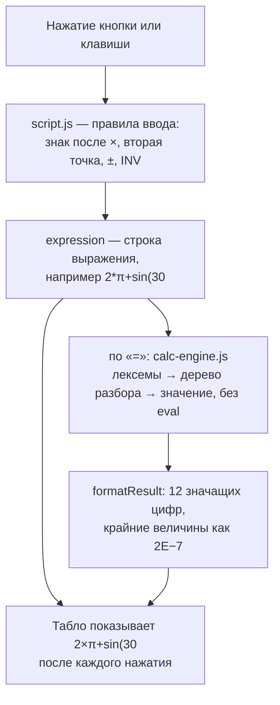

# Разбор: калькулятор после GigaCode

> Начат 2026-10-06, до правок кода. Исходная версия, как её сдала GigaCode, лежит снимком
> в [gigacode-original/](gigacode-original/) (`server.py` и `start.command` — с расширением
> `.txt`, чтобы опасный исходный скрипт не запускался двойным кликом).
> Документ живой: закрытые пункты — в разделе «Закрыто» внизу, со ссылкой на проверку.
> Оценка самой модели — отдельно: [OTCHET-GIGACODE.md](OTCHET-GIGACODE.md).

## Сводка

1. **Скрипт не выполняется вообще.** В `script.js:132` регулярное выражение
   `/([\w]+\($/` с незакрытой скобкой — это синтаксическая ошибка, браузер отбрасывает
   весь файл. Ни одна функция не объявлена, каждая кнопка падает с `ReferenceError`,
   табло навсегда показывает «0» из разметки. Это и есть жалоба «кнопки не меняют табло».
2. **Даже с исправленной скобкой табло не показывает ввод:** набранное уходит в мелкую
   серую строку над табло, само табло меняется только по «=». Жалоба осталась бы.
3. **Счёт построен на подмене строк регулярками и `eval`** — отсюда целое семейство
   ошибок: sin/cos/tan в режиме DEG (а он по умолчанию) вызывают несуществующие
   `sinDeg`…, обратные функции ломает порядок замен, `%` — остаток от деления, `−2^2`
   и `2π` — синтаксические ошибки JS, результат вида `2e-7` при продолжении счёта
   рассыпается.
4. **Ввод не как у калькулятора:** ± меняет знак всего выражения, после × нельзя
   набрать отрицательное число, вторая точка ломает число, n! после результата стирает
   результат, клавиатурный обработчик глотает Cmd+R и Cmd+C.
5. **Запуск опасен и путан:** `start.command` убивает **любой** процесс на порту,
   порт из аргумента не доходит до `server.py`, браузер открывается дважды, сервер
   слушает все сетевые интерфейсы.
6. **README обещает то, чего нет**, и учит публикации на GitHub, хотя просили GitVerse (позже владелец сам выбрал GitHub);
   раздел «Скриншоты» — бейдж вместо скриншота.
7. Закрываем всё это за одну итерацию, фазы A–H. Не делаем: перенос счёта на Python,
   память и историю, полную точность при продолжении счёта (см. «Чего не делаем»).

## Схема: путь одного нажатия

Было:



Стало:



Легенда: верхняя схема — что происходило в исходной версии; нижняя — после правок.

## Таблица разрывов

Важность — по последствию: **несущий** — основной сценарий не работает или молча врёт;
**важный** — функция, обещанная в README, не работает; **терпит** — неудобство или крайний
случай. Сценарии — номера из [tests/scenarios.js](../tests/scenarios.js).

| № | Разрыв | Где (исходная версия) | Важность | Фаза | Сценарии |
|---|---|---|---|---|---|
| Р1 | Регулярка с незакрытой скобкой — браузер не выполняет `script.js` целиком | `script.js:132` | несущий | A.1 | все |
| Р2 | Табло не показывает ввод; набранное — в мелкой серой строке, табло меняется только по «=» | `script.js:168-170` | несущий | A.2 | Т1–Т3, Т8, Т12, Т13 |
| Р3 | sin/cos/tan в режиме DEG (по умолчанию) вызывают несуществующие `sinDeg`/`cosDeg`/`tanDeg` → «Ошибка» | `script.js:201-207` | несущий | B | Ф1, Ф3, Ф4, Ф6 |
| Р4 | Обратные функции в RAD ломаются порядком замен: `asin(` → `aMath.sin(` | `script.js:209-214` | важный | B | Ф7 |
| Р5 | `%` уходит в `eval` как остаток от деления: `50%` → «Ошибка», `10%3` = 1 | `script.js:39`, `eval` | важный | B | Ф22, Ф23 |
| Р6 | Нет неявного умножения: `2π`, `2(3)` → «Ошибка» | `eval` | важный | B | Ф21 |
| Р7 | `−2^2` превращается в `-2**2` — синтаксическая ошибка JS | `script.js:198` | важный | B | Ф25 |
| Р8 | n! только для целого числа перед «!»: `(2+1)!` → «Ошибка»; n! от большого числа крутит цикл до n и подвешивает страницу | `script.js:173-181,195` | важный | B | Ф15 |
| Р9 | Незакрытые скобки не закрываются: `sin(30` = → «Ошибка» | `eval` | важный | B | Ф2 |
| Р10 | Результат в E-нотации (`2e-7`) при продолжении: буква e заменяется числом e → «Ошибка» | `script.js:192` | терпит | B | Т17 |
| Р11 | INV exp даёт log₁₀ вместо ln; INV log/ln дописывают `10^`/`e^` без скобки (после цифры выходит `210^…`); INV \|x\| молча ничего не делает; надписи кнопок в режиме INV не меняются | `script.js:49-79` | важный | C | Ф19 |
| Р12 | После ×, ÷, ^ нельзя набрать минус — он заменяет знак: `2×−3` = −1, `2^−1` = 1 | `script.js:24-26` | важный | C | Т16, Ф24 |
| Р13 | ± меняет знак всего выражения: `5+3 ±` = −2 | `script.js:143-152` | важный | C | Т15 |
| Р14 | n! после результата стирает результат; после «Ошибка» строка «Ошибка» становится выражением | `script.js:16-21,240-251` | терпит | C | Ф26, Т10 |
| Р15 | Вторая точка в числе ломает выражение: `1.2.3` → «Ошибка» | `script.js:15-30` | терпит | C | Т14 |
| Р16 | Подсветка DEG при загрузке не совпадает с режимом | `index.html:21` | терпит | C | К4 |
| Р17 | Клавиатура: `preventDefault()` на любую клавишу — не работают Cmd+R, Cmd+C, масштаб; запятая (цифровой блок в русской раскладке) не принимается | `script.js:261-279` | важный | D | К2, К3 |
| Р18 | Кнопка «=» (`grid-row: span 2`) в последнем ряду вылезает вниз отдельным рядом | `style.css:151-155` | терпит | E | К5 |
| Р19 | `start.command` убивает любой процесс, у которого есть сокет на порту (`kill $(lsof -t -i :PORT)`), — чужой сервер, браузер с открытым соединением | `start.command:69-88` | несущий (безопасность) | F | ручная |
| Р20 | Порт из аргумента `start.command` не передаётся в `server.py`; подсказка `python server.py <порт>` описывает несуществующую возможность | `start.command:31,92`, `server.py:18,95` | важный | F | ручная |
| Р21 | Браузер открывается дважды: `server.py` по таймеру и `start.command` | `server.py:67`, `start.command:121-123` | терпит | F | ручная |
| Р22 | Сервер слушает все интерфейсы (калькулятор и папка видны из локальной сети); однопоточный `TCPServer` без повторного использования адреса; лишние CORS-заголовки | `server.py:27-32,72` | важный (безопасность) | F | ручная |
| Р23 | README: «полнофункциональный», «полная поддержка клавиатуры», «%» — неправда; публикация на GitHub вместо GitVerse; «скриншот» — бейдж; таблица совместимости браузеров не проверялась; лицензия MIT без файла | `README.md` | важный | G | ручная |
| Р24 | `.gitignore` под Python-пакеты (eggs, wheels), `.DS_Store` дважды | `.gitignore` | терпит | G | ручная |
| Р25 | Ни одной проверки; пункт «Проверить работоспособность» закрыт по выводу `ls` и `wc -l` | — | несущий (процесс) | H | — |

## Метрика «до»

**48 сценариев пользователя**, прогон в настоящем Chrome страницей
[tests/scenarios.html](../tests/scenarios.html) — она нажимает кнопки калькулятора в рамке
и сверяет табло.

| Версия | Пройдено | Табло и ввод | Функции | Клавиатура и интерфейс |
|---|---|---|---|---|
| исходная (GigaCode) | **2 из 48** | 1/17 | 0/26 | 1/5 |
| исходная + одна правка Р1 (закрыть скобку) | **19 из 48** | 6/17 | 12/26 | 1/5 |

Оба «прохода» исходной версии случайны: Т11 (AC → «0») проходит, потому что на табло
всегда «0», а К3 (Cmd+R не перехвачен) — потому что обработчик клавиатуры так и не подключился.

Как получено:

```bash
python3 server.py 8090        # откроется калькулятор; дальше в браузере:
# http://localhost:8090/tests/scenarios.html?target=../docs/gigacode-original/
# строка «Пройдено N из 48» вверху страницы
node --check docs/gigacode-original/script.js   # SyntaxError ... Unterminated group (строка 132)
```

Строка «+ одна правка Р1» получена на копии исходной версии вне репозитория, где
в строке 132 `/([\w]+\($/` заменено на `/([\w]+\()$/`; других отличий нет.

## Решения

| Решение | Почему | Цена |
|---|---|---|
| Счёт — собственный разбор выражения (`calc-engine.js`), без `eval` | половина разрывов (Р3–Р10) растёт из подмены строк регулярками; разбор даёт приоритеты, неявное умножение, постфиксные `!` и `%`, понятные ошибки; движок проверяется в Node без браузера | ~250 строк вместо ~40 |
| `a + b%` = a + a·b/100, `a × b%` = a·b/100, одиночное `b%` = b/100 | так считает обычный настольный калькулятор, который упомянут в запросе («всё как в обычном калькуляторе») | правило надо знать — описано в README |
| Неявное умножение — того же приоритета, что × и ÷, слева направо | простое правило без исключений: `1/2π` = (1/2)·π | кто ждёт 1/(2π), должен поставить скобки |
| Степень сильнее унарного минуса: `−2^2` = −4 | математическая запись | — |
| В E-нотации заглавная E (`2E−7`), строчная e — всегда число e | иначе `2e−1` неоднозначно: 2·e−1 или 0.2 | — |
| Режим INV остаётся включённым до повторного нажатия, надписи кнопок меняются (sin⁻¹, 10ˣ, eˣ, x², ln) | так было задумано в исходной версии; теперь видно, что делает каждая кнопка | — |
| Сервер — только `127.0.0.1`, многопоточный, без кэша; браузер открывает только `server.py` | калькулятору не нужен доступ из сети; без кэша правка файлов видна сразу | с телефона в той же сети не открыть — для этого GitHub Pages |
| Публикация — GitHub и GitHub Pages, в корне `.nojekyll` | решение владельца 2026-10-06 вместо GitVerse из первого запроса; сайт статический, сборка Jekyll ему не нужна | — |
| Проверки без зависимостей: движок — `node --test`, сценарии — страница в браузере | проект «базовый», ставить пакеты ради проверок незачем | для движка нужен Node.js 18+ |

## Чего не делаем сейчас

| Не делаем | Довод |
|---|---|
| Перенос счёта на Python (сервер с `/api/calc`) | калькулятору сервер не нужен: счёт в браузере работает и без сервера, и на GitHub Pages, где Python не исполняется. Если «проект на питоне» в запросе означал именно счёт на Python — это вопрос владельцу, запись в [BEKLOG.md](BEKLOG.md) |
| Полная точность при продолжении счёта | продолжение идёт от показанных 12 значащих цифр — как и в исходной версии; для «обычного калькулятора» достаточно |
| Память (MC, MR, M+), история, копирование результата | не просили, README не обещает |
| Клавиши для функций (s — sin и т. п.) | README больше не обещает «полную поддержку клавиатуры»; перечислены клавиши, которые работают |
| Вещественный корень нечётной степени из отрицательного: `(−8)^(1/3)` | `Math.pow` даёт NaN → «Ошибка»; случай редкий, ошибка честная |
| Файл лицензии, git-репозиторий, публикация | решение владельца; см. [BEKLOG.md](BEKLOG.md) |

## Закрыто

2026-10-06, все фазы A–H за одну итерацию. Проект пока не под git, поэтому вместо
коммитов — проверки; изменения видны сравнением с [gigacode-original/](gigacode-original/).

### Метрика «после»

| Набор проверок | Исходная | После правок | Команда |
|---|---|---|---|
| Сценарии в Chrome | 2 из 48 | **48 из 48** | `http://localhost:8080/tests/scenarios.html` (для исходной `?target=../docs/gigacode-original/`) |
| Движок счёта | — | **12 из 12** групп | `node --test tests/` |
| Запуск | — | **5 из 5** | `python3 tests/test_launch.py` |

Проверки не пустые: четыре испорченные копии движка (процент как обычное деление,
без обнуления остатка тригонометрии, строгий факториал, левая ассоциативность
степени) и копия `start.command`, не передающая порт, — каждую ловит хотя бы одна
проверка. Испорченные копии делались вне репозитория.

### По разрывам

| № | Стало | Чем подтверждается |
|---|---|---|
| Р1 | `script.js` переписан; синтаксис проверяется до запуска | `node --check script.js calc-engine.js`; все 48 сценариев |
| Р2 | `updateDisplay()` пишет в табло; строка над ним — последнее вычисление «выражение =» | Т1–Т3, Т8, Т12, Т13; [до](img/before-gigacode.png) → [после](img/after-fix-typing.png) |
| Р3 | `calc-engine.js`: градусы переводятся в радианы внутри функции; остаток меньше 1e−15 — ноль; tan 90° — «Ошибка» | Ф1, Ф3, Ф4, Ф6; тест «тригонометрия в градусах (Р3)» |
| Р4 | Функции распознаются целыми именами по списку, строки не подменяются | Ф7; тест «…и обратные функции (Р4)» |
| Р5 | `%` — постфиксный знак; `a ± b%` — процент от a | Ф22, Ф23; тест «проценты… (Р5)» |
| Р6 | Неявное умножение — правило грамматики | Ф21; тест «неявное умножение (Р6)» |
| Р7 | Степень сильнее унарного минуса и правоассоциативна | Ф24, Ф25; тест «унарный минус и степень (Р7, Р12)» |
| Р8 | n! — постфикс к любому операнду; цикл обрывается на 171! | Ф15; тест «факториал… без зависания (Р8)» |
| Р9 | Недостающие «)» в конце подразумеваются; строка истории их показывает | Ф2; тест «незакрытые скобки… (Р9)» |
| Р10 | В E-нотации заглавная E; лексер читает `2E-7` как число | Т17; тест «результат в E-нотации… (Р10)» |
| Р11 | INV: exp → ln, log → `10^(`, ln → `e^(`, √ → x² к набранному, \|x\| без обратной; надписи кнопок меняются (`data-inv`) | Ф16–Ф19 |
| Р12 | Минус после ×, ÷, ^ дописывается, а не заменяет знак | Т16, Ф24 |
| Р13 | ± меняет знак последнего операнда: числа, константы, скобки с функцией | Т15 |
| Р14 | n!, %, x² после «=» продолжают результат; после «Ошибка» ввод начинается заново | Ф26, Т10 |
| Р15 | Вторая точка не ставится; лексер отвергает `1.2.3` | Т14; тест «ошибки разбора…» |
| Р16 | Подсветка DEG выставляется при загрузке | К4 |
| Р17 | Сочетания с Cmd/Ctrl/Alt не перехватываются; `preventDefault` — только для своих клавиш; запятая = точка | К2, К3 |
| Р18 | У «=» убран `grid-row: span 2` | К5; скриншоты Р2 |
| Р19 | `start.command` никого не убивает; занятый порт — сообщение `server.py` и код 1 | `test_busy_port_leaves_other_program_alive` |
| Р20 | Порт: аргумент `start.command` → `server.py`; подсказка про порт верная | `test_start_command_passes_port`, `test_port_from_argument_and_ctrl_c`, `test_bad_port_argument` |
| Р21 | Браузер открывает только `server.py`, когда порт уже открыт | ручная: в `start.command` нет вызова `open` |
| Р22 | Только `127.0.0.1`, `ThreadingHTTPServer`, `Cache-Control: no-cache`, без CORS | `test_not_visible_from_local_network`; `curl -sI http://localhost:8080/` |
| Р23 | README: правила счёта, реальные клавиши, публикация на GitHub и GitHub Pages (решение владельца), раздел о проверке GigaCode, настоящий скриншот; убраны непроверенная таблица совместимости и лицензия без файла | ручная; бэклог 2, 3 |
| Р24 | `.gitignore` сокращён до нужного | ручная |
| Р25 | Три набора проверок (см. метрику) | прогоны выше |

Попутно остановлен сервер, который GigaCode запустила через `nohup` на порту 8000
и не остановила: после переименования папки KIMITEST → ENGINEER он раздавал эту папку
на всех сетевых интерфейсах.
